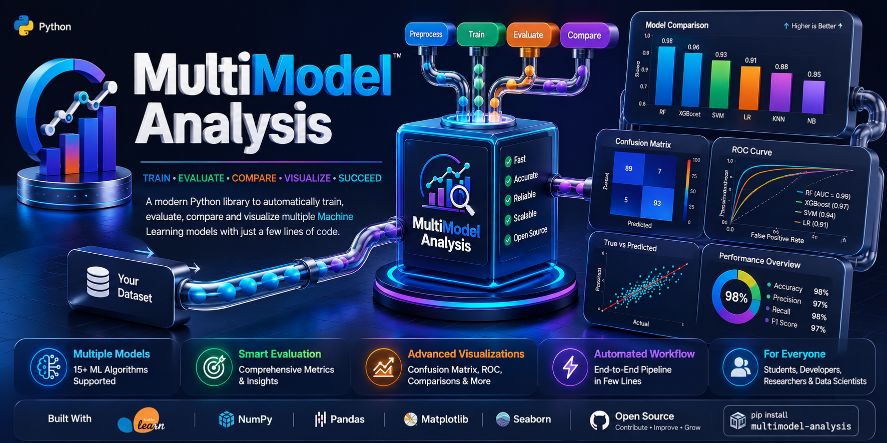
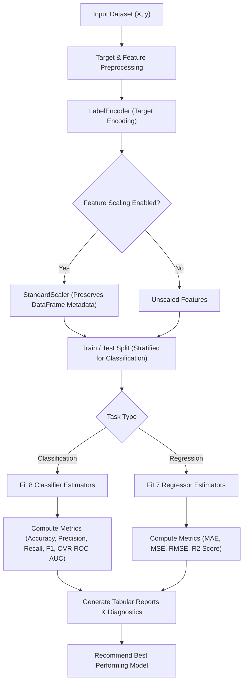

# MultiModel Analysis

<p align="center">
  
</p>

[](https://pypi.org/project/multimodel-analysis/)
[](https://pypi.org/project/multimodel-analysis/)
[](https://pypi.org/project/multimodel-analysis/)
[](https://pepy.tech/project/multimodel-analysis)
[](LICENSE)
[](https://scikit-learn.org/)

**MultiModel Analysis** is a Python framework designed to automate model benchmarking, evaluation, and visualization for Supervised Machine Learning tasks (Classification and Regression). It provides a unified interface for training multiple baseline models, computing statistical evaluation metrics, generating diagnostic visualizations, and identifying optimal model candidates.

---

## Table of Contents

- [Overview](#overview)
- [Design Architecture](#design-architecture)
- [Supported Estimators](#supported-estimators)
- [Installation](#installation)
- [Quick Start Guide](#quick-start-guide)
  - [Classification Pipeline](#classification-pipeline)
  - [Regression Pipeline](#regression-pipeline)
- [API Reference](#api-reference)
  - [MultiModelClassifier](#multimodelclassifier)
  - [MultiModelRegressor](#multimodelregressor)
- [Evaluation Metrics](#evaluation-metrics)
- [Dependencies](#dependencies)
- [License and Citation](#license-and-citation)

---

## Overview

Selecting an appropriate estimator for a given tabular dataset requires benchmarking multiple baseline algorithms. Manually executing model fitting, cross-validation, feature scaling, metric aggregation, and plotting leads to repetitive code overhead.

`multimodel_analysis` streamlines this process by implementing an automated execution pipeline:

1. **Automated Preprocessing**: Applies standard scaling (`StandardScaler`) while preserving pandas DataFrame structure and column metadata.
2. **Label Encoding**: Encodes target arrays (`LabelEncoder`) to support numerical, string, and categorical target types across binary and multiclass tasks.
3. **Stratified Splitting**: Implements stratified train-test splits (`train_test_split`) for classification tasks to maintain target class proportions.
4. **Fault-Tolerant Training**: Wraps individual model evaluations in isolated execution blocks to prevent full execution failure if a single estimator encounters a fitting exception.
5. **Metric Calculation & Visualization**: Computes standardized evaluation metrics and renders diagnostic plots (Confusion Matrices, ROC Curves, Residual/Prediction Scatter plots, and Bar Charts).

---

## Design Architecture



---

## Supported Estimators

### Classification (`MultiModelClassifier`)

- Logistic Regression (`LogisticRegression`)
- Support Vector Machine (`SVC`)
- K-Nearest Neighbors Classifier (`KNeighborsClassifier`)
- Decision Tree Classifier (`DecisionTreeClassifier`)
- Random Forest Classifier (`RandomForestClassifier`)
- Gaussian Naive Bayes (`GaussianNB`)
- Gradient Boosting Classifier (`GradientBoostingClassifier`)
- AdaBoost Classifier (`AdaBoostClassifier`)

### Regression (`MultiModelRegressor`)

- Linear Regression (`LinearRegression`)
- Lasso Regression (`Lasso`)
- Ridge Regression (`Ridge`)
- Support Vector Regression (`SVR`)
- Decision Tree Regressor (`DecisionTreeRegressor`)
- Random Forest Regressor (`RandomForestRegressor`)
- Gradient Boosting Regressor (`GradientBoostingRegressor`)

*(Note: `MultiModelRegressior` is retained as an explicit alias for backwards compatibility).*

---

## Installation

### Stable Release from PyPI

```bash
pip install multimodel-analysis
```

To upgrade an existing installation to the latest version:

```bash
pip install --upgrade multimodel-analysis
```

### Installation from Source

```bash
pip install git+https://github.com/udityamerit/Multimodel-Analysis-Pacakge.git
```

---

## Quick Start Guide

### Classification Pipeline

```python
import pandas as pd
from multimodel_analysis import MultiModelClassifier

# 1. Prepare features and target variable
df = pd.read_csv("dataset.csv")
X = df.drop(columns=["target"])
y = df["target"]

# 2. Instantiate MultiModelClassifier
classifier = MultiModelClassifier(
    X=X,
    y=y,
    test_size=0.3,
    scaled_data=True,
    random_state=42,
    stratify=True
)

# 3. Train all classification models
results = classifier.run_all_models()

# 4. Display tabular performance report
classifier.show_tabular_report(results)

# 5. Render diagnostic figures
classifier.plot_confusion_matrices(results)
classifier.plot_roc_curves(results)
classifier.plot_comparison(results)
```

---

### Regression Pipeline

```python
import pandas as pd
from multimodel_analysis import MultiModelRegressor

# 1. Prepare features and target variable
df = pd.read_csv("housing.csv")
X = df.drop(columns=["Price"])
y = df["Price"]

# 2. Instantiate MultiModelRegressor
regressor = MultiModelRegressor(
    X=X,
    y=y,
    test_size=0.3,
    scaled_data=True,
    random_state=42
)

# 3. Train all regression models
results = regressor.run_all_models()

# 4. Display tabular performance report
regressor.show_tabular_report(results)

# 5. Render diagnostic figures
regressor.plot_true_vs_predicted(results)
regressor.plot_comparison(results)
```

---

## API Reference

### `MultiModelClassifier`

```python
multimodel_analysis.MultiModelClassifier(
    X, 
    y, 
    test_size=0.3, 
    scaled_data=False, 
    random_state=42, 
    stratify=True
)
```

#### Parameters

- **`X`** : *pandas.DataFrame or numpy.ndarray of shape (n_samples, n_features)*  
  The feature matrix.
- **`y`** : *pandas.Series or numpy.ndarray of shape (n_samples,)*  
  The target array containing discrete class labels (numerical or string types).
- **`test_size`** : *float, default=0.3*  
  The proportion of the dataset to include in the test split. Must be between `0.0` and `1.0`.
- **`scaled_data`** : *bool, default=False*  
  If `True`, fits and applies a `StandardScaler` to the training and test feature sets. Preserves DataFrame column names and indices when input is a pandas DataFrame.
- **`random_state`** : *int, default=42*  
  Seed used by the random number generator for reproducible train-test splitting and estimator initialization.
- **`stratify`** : *bool, default=True*  
  If `True`, performs stratified sampling during train-test splitting when target class counts allow it (minimum sample count per class >= 2).

#### Instance Attributes

- **`X_train_scaled`** : Training feature set (scaled or unscaled).
- **`X_test_scaled`** : Test feature set (scaled or unscaled).
- **`y_train`** : Encoded training target array.
- **`y_test`** : Encoded test target array.
- **`label_encoder`** : Fitted `LabelEncoder` instance.
- **`classes_`** : Original class names array.

#### Methods

- **`run_all_models()`**  
  Fits all eight classification estimators. Returns a list of evaluation result tuples.  
  *Returns*: `list of tuple`

- **`show_tabular_report(models, return_df=False)`**  
  Prints a formatted comparison table sorted by Accuracy and displays the best performing model recommendation.  
  *Parameters*:  
  - `models` (`list`): List of evaluated model tuples returned by `run_all_models()`.  
  - `return_df` (`bool`, default=`False`): If `True`, returns the underlying `pandas.DataFrame`. Otherwise returns `None`.

- **`plot_confusion_matrices(models)`**  
  Renders heatmaps of confusion matrices for all evaluated models, displaying original class labels.

- **`plot_roc_curves(models)`**  
  Plots combined Receiver Operating Characteristic (ROC) curves and corresponding AUC metrics.

- **`plot_comparison(models)`**  
  Renders a comparative bar chart for Accuracy, Precision, Recall, and F1 Score across all models.

- **`get_summary(models)`**  
  Executes the full reporting and visualization suite (`show_tabular_report`, `plot_confusion_matrices`, `plot_roc_curves`, `plot_comparison`).

---

### `MultiModelRegressor`

```python
multimodel_analysis.MultiModelRegressor(
    X, 
    y, 
    test_size=0.3, 
    scaled_data=False, 
    random_state=42
)
```

#### Parameters

- **`X`** : *pandas.DataFrame or numpy.ndarray of shape (n_samples, n_features)*  
  The feature matrix.
- **`y`** : *pandas.Series or numpy.ndarray of shape (n_samples,)*  
  The target array containing continuous numerical values.
- **`test_size`** : *float, default=0.3*  
  The proportion of the dataset to include in the test split. Must be between `0.0` and `1.0`.
- **`scaled_data`** : *bool, default=False*  
  If `True`, applies `StandardScaler` to features, retaining column names if `X` is a DataFrame.
- **`random_state`** : *int, default=42*  
  Seed used by the random number generator for reproducible splitting.

#### Methods

- **`run_all_models()`**  
  Fits all seven regression estimators. Returns a list of evaluation result tuples.  
  *Returns*: `list of tuple`

- **`show_tabular_report(models, return_df=False)`**  
  Prints a formatted comparison table sorted by R² Score and displays the best model recommendation.  
  *Parameters*:  
  - `models` (`list`): List of evaluated model tuples returned by `run_all_models()`.  
  - `return_df` (`bool`, default=`False`): If `True`, returns the underlying `pandas.DataFrame`. Otherwise returns `None`.

- **`plot_true_vs_predicted(models)`**  
  Renders scatter plots comparing ground-truth targets against model predictions with an ideal linear reference.

- **`plot_comparison(models)`**  
  Renders a comparative bar chart of R² Scores across evaluated regressor models.

- **`get_summary(models)`**  
  Executes the full reporting suite (`show_tabular_report`, `plot_true_vs_predicted`, `plot_comparison`).

---

## Evaluation Metrics

### Classification Metrics

- **Accuracy**: $\frac{TP + TN}{TP + TN + FP + FN}$
- **Precision (Weighted)**: $\sum_{c} w_c \cdot \frac{TP_c}{TP_c + FP_c}$
- **Recall (Weighted)**: $\sum_{c} w_c \cdot \frac{TP_c}{TP_c + FN_c}$
- **F1 Score (Weighted)**: $2 \cdot \frac{\text{Precision} \cdot \text{Recall}}{\text{Precision} + \text{Recall}}$
- **ROC-AUC**: Computed using positive-class probabilities for binary tasks and One-vs-Rest (`ovr`) strategy for multiclass tasks.

### Regression Metrics

- **Mean Absolute Error (MAE)**: $\frac{1}{n} \sum_{i=1}^n |y_i - \hat{y}_i|$
- **Mean Squared Error (MSE)**: $\frac{1}{n} \sum_{i=1}^n (y_i - \hat{y}_i)^2$
- **Root Mean Squared Error (RMSE)**: $\sqrt{\frac{1}{n} \sum_{i=1}^n (y_i - \hat{y}_i)^2}$
- **Coefficient of Determination ($R^2$)**: $1 - \frac{\sum_{i=1}^n (y_i - \hat{y}_i)^2}{\sum_{i=1}^n (y_i - \bar{y})^2}$

---

## Dependencies

- `python >= 3.8`
- `numpy`
- `pandas`
- `matplotlib`
- `seaborn`
- `scikit-learn`

---

## License and Citation

This project is licensed under the Apache Software License 2.0.

**Author**: Uditya Narayan Tiwari  
**Repository**: [https://github.com/udityamerit/Multimodel-Analysis-Pacakge](https://github.com/udityamerit/Multimodel-Analysis-Pacakge)  
**PyPI Package**: [https://pypi.org/project/multimodel-analysis/](https://pypi.org/project/multimodel-analysis/)